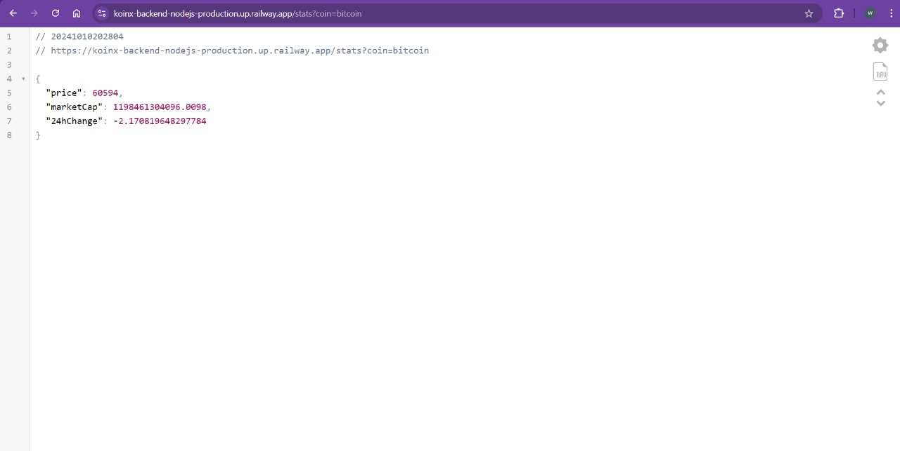
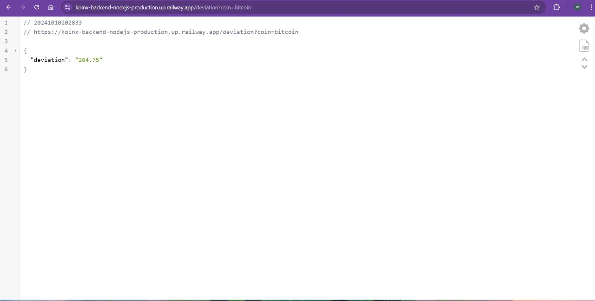

# Cryptocurrency Price Tracker

This project is a cryptocurrency price tracker that fetches and stores data for Bitcoin, Matic, and Ethereum using the CoinGecko API. The application provides APIs to retrieve the latest cryptocurrency statistics and calculate the standard deviation of the price over the last 100 records.

## Table of Contents

- [Features](#features)
- [Tech Stack](#tech-stack)
- [API Endpoints](#api-endpoints)
- [Setup Instructions](#setup-instructions)
- [Background Job](#background-job)
- [Optional Tasks](#optional-tasks)

## Features

- Fetches the latest price, market cap, and 24-hour change for Bitcoin, Matic, and Ethereum every 2 hours.
- Stores the fetched data in a MongoDB database.
- Provides an API to retrieve the latest stats for any of the three cryptocurrencies.
- Calculates and returns the standard deviation of the cryptocurrency price for the last 100 records.

## Tech Stack

- **Backend**: Node.js, Express
- **Database**: MongoDB (with Mongoose ODM)
- **API Client**: Axios
- **Scheduling**: Node-cron

## API Endpoints

### 1. Get Latest Stats

**Endpoint:** `GET /stats`

**Query Parameters:**

- `coin`: One of the following values: `bitcoin`, `matic-network`, `ethereum`.



### 2. Get Latest deviation

**Endpoint:** `GET /deviation`

**Query Parameters:**

- `coin`: One of the following values: `bitcoin`, `matic-network`, `ethereum`.
  

**Response:**

```json
{
  "price": 40000,
  "marketCap": 800000000,
  "24hChange": 3.4
}
```

## Setup Instructions

1. **Clone the Repository**

```terminal
$ git clone https://github.com/wraith2009/KoinX-Backend-nodejs.git
$ npm i
```

## project structure

```terminal
src/
server.js
.env
package.json
...
```

# Usage

## Prerequisites

- [MongoDB](https://gist.github.com/nrollr/9f523ae17ecdbb50311980503409aeb3)
- [Node](https://nodejs.org/en/download/) ^10.0.0
- [npm](https://nodejs.org/en/download/package-manager/)
